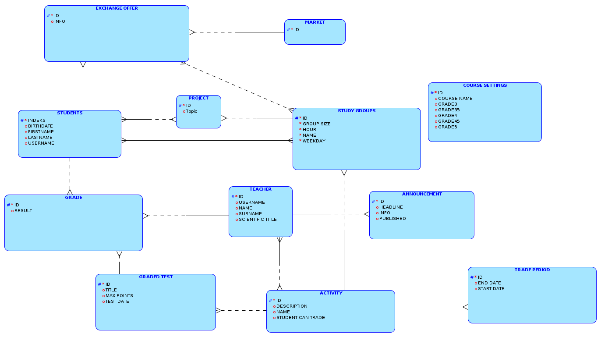

# PAP22L-Z15 (edycja projektu pod BD1)

# Zespół:
* Sidorczuk Dominik
* Sroka Tomasz
* Stawarski Krzysztof
* Tsupin Fedir

# Zadanie:
USUS - Ulepszony System Upychania Studentów

Projekt pozwala na:
- weryfikację uprawnień użytkownika (LDAP)
- zapisy studentów do grup
- wymianę pomiędzy grupami studentów
- publikowanie ogłoszeń
- wstawianie punktów za poszczególne zadania
- modyfikację progów na daną ocenę
- wystawienie oceny końcowej

Wybrana technologia: Java Spring

# Odpalenie aplikacji

Aby efektywnie odpalić aplikację i jej zależności należy użyć dockera w następujący sposób:
1. należy skopiować plik docker-compose.yml z repo do katalogu roboczego (dzieje się to automatycznie, jeśli zrobimy `git clone`)
2. należy wywołać w linii poleceń:
```shell
docker compose up
```
3. po chwili aplikacja powinna wstać i funkcjonować poprawnie
4. aby uzyskać dostęp do interfejsu, należy przejść etap weryfikacji. Dostępne konta to np. kstawars, tsroka (studenci) albo jmyrcha, kzbikows (prowadzący). Interfejs dla każdej z tych grup wygląda inaczej, więc warto skorzystać z obu opcji w ramach sprawdzania funkcjonalności. Hasło do wszystkich kont to: `ihatejava`.

# Lokalizacja elementów wymaganych na BD1 w repo:
- model ER: 
- model relacyjny: 
- [skrypty DDL do stworzenia bazy](BD1/DDL_USUS.sql)
- [skrypty do załadowania danych](BD1/insert_data.sql)
- [wyzwalacze](BD1/triggers/)
- [procedury](BD1/procedures/)
- [funkcje](BD1/functions/)
- [testy](BD1/test.sql)
- aplikacja: cała reszta

